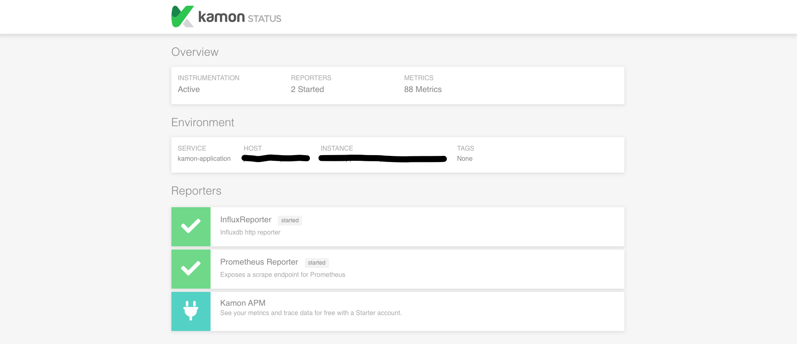
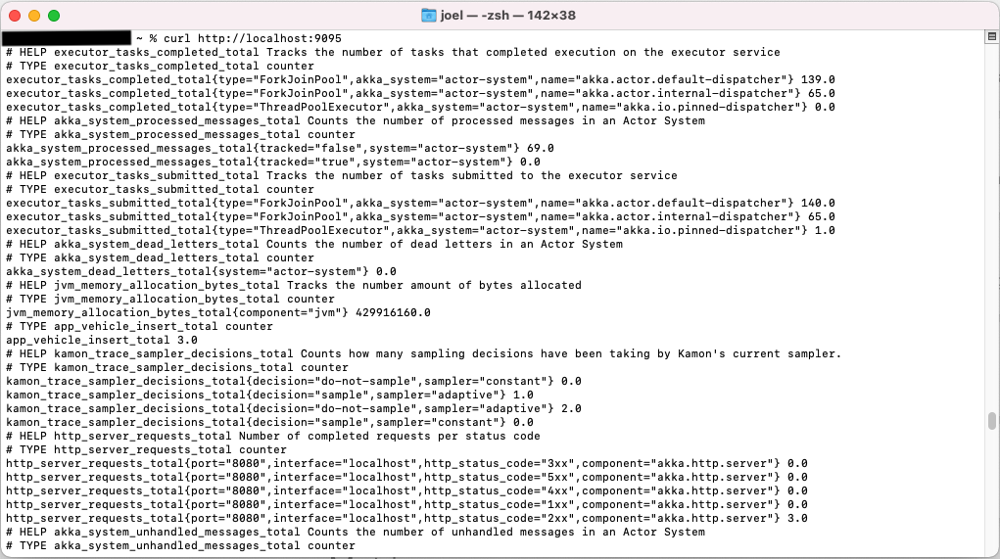

# Akka Http Kamon Example

This project introduces collection metrics with Kamon integrated into an Akka Http project. Please refer
to https://kamon.io/ for more information about Kamon. This project uses the libraries

- Kamon Core
- Kamon Http
- Kamon Influx

to collect metrics and submit the metrics to an InfluxDB. The project uses the Lightbend Config library to read the
needed configuration parameters to submit data to the InfluxDB. Please refert to https://github.com/lightbend/config for
more information about the Lightbend config library.

I developed this example projected based on following two guides.

The first guide covers a Kamon elementary Akka setup:

https://kamon.io/docs/latest/guides/frameworks/elementary-akka-setup/

The second guide covers a basic introduction of using Kamon when a plain application is developed:

https://kamon.io/docs/latest/guides/installation/plain-application/

## Kamon Status Page

The maven module

    <dependency>
        <groupId>io.kamon</groupId>
        <artifactId>kamon-status-page_2.13</artifactId>
        <version>2.1.10</version>
    </dependency>

provides a status page which is available at http://localhost:5266.

The Kamon Status Page provides information about the reporters, modules and metrics of the application.

## Prometheus Metrics Reporter

This application uses the Prometheus metrics reporter. Hence, the Prometheus metrics are available at
curl http://localhost:9095.

The following maven dependency provides the Prometheus metrics reporter:

        <dependency>
            <groupId>io.kamon</groupId>
            <artifactId>kamon-prometheus_2.13</artifactId>
            <version>2.1.4</version>
        </dependency>

## Influxdb Metrics Reporter

This application uses the Influxdb metrics reporter. Hence, the Influxdb metrics are available at
curl http://localhost:9095.

The following mavend dependency provides the Influxdb metrics reporter:

        <dependency>
            <groupId>io.kamon</groupId>
            <artifactId>kamon-influxdb_2.13</artifactId>
            <version>2.1.4</version>
        </dependency>

## Curl Requests

Please consider following Curl Requests to query the interface of this application.

`curl -H "Content-Type: application/json" -X POST -d '{"vin":"UIFJ39394","mileage":42}' http://localhost:8080/add-vehicle`

`curl -H "Content-Type: application/json" -X POST -d '{"vin":"UIFJ39394","mileage":53}' http://localhost:8080/update-vehicle`

`curl http://localhost:8080/get-vehicle\?vin=UIFJ39394`

## Logging

This application uses a Log4j2 logging setup with an log4j-slf4j log binding. Please refer to

https://www.baeldung.com/slf4j-with-log4j2-logback

for more information.

## Issues

The application throws a warning about an illegal reflective access of Kamon. This issue is
open: https://github.com/kamon-io/Kamon/issues/641